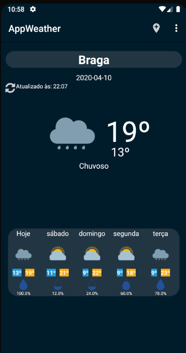
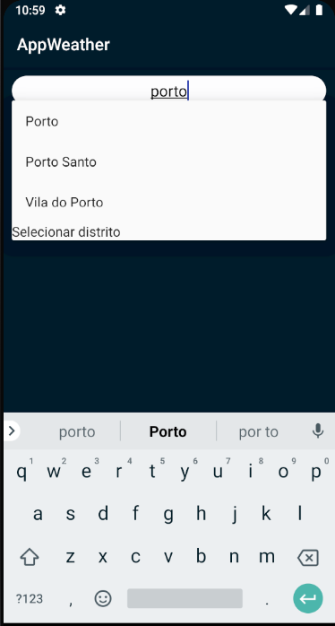

# AppWeather
## Projeto Intermedio da UC Paradigmas da Programação II

Universidade do Minho

* Nota final: 18 em 20 valores

### Descrição do Projeto

Aplicação para obter a informação meteorológica de uma lista de cidades. O utilizador pode ter no seu menu quantas cidades quiser. O objetivo era o consumo da api disponibilizada pelo IPMA.

### Imagens dos menus

  
   

